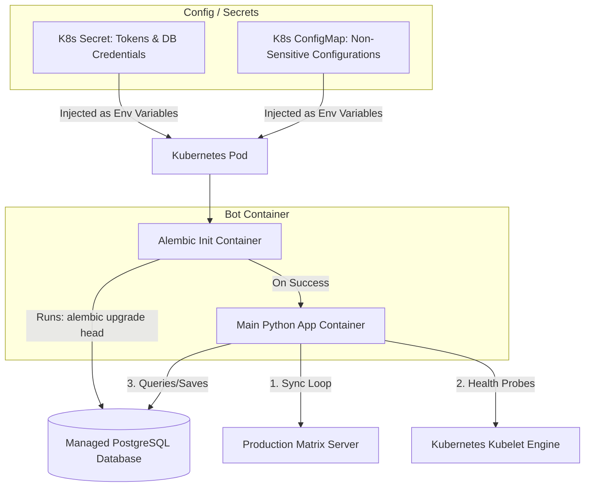

# Deployment & Operations Guide: Local vs. Production

This document describes how to configure, run, and scale the Matrix Multi-Capability Bot in both local development environments and production Kubernetes clusters.

---

## 1. Local Running Architecture (Development)

Locally, the bot uses **Astral's `uv`** to unify dependency resolution, virtualenv management, and execution into a single toolchain.

```mermaid
graph LR
    Developer[Developer Command Line]
    Config[.env File]
    BotApp[Bot Process (uv run python -m src.main)]
    DB[(Local SQLite: bot.db)]
    Matrix[Matrix Homeserver (matrix.org)]
    
    Developer -->|Configures| Config
    Developer -->|Runs| BotApp
    Config -->|Loads Env| BotApp
    BotApp -->|Reads/Writes| DB
    BotApp -->|Syncs API| Matrix
```

### 1.1 Local Setup & Execution Walkthrough
Since `uv` manages the virtual environment automatically based on [`pyproject.toml`](file:///home/andreas/bot/pyproject.toml), you do not need to manually create a virtualenv or run `pip install`.

1.  **Configuration:**
    Copy `.env.example` to `.env` and fill in your Matrix credentials:
    ```bash
    cp .env.example .env
    ```

2.  **Local Database Migrations:**
    To automatically set up a virtual environment (if it doesn't exist), install Alembic, and run migrations against SQLite:
    ```bash
    uv run alembic upgrade head
    ```
    *(This creates the local `bot.db` SQLite file under `/app/data/` with all database tables).*

3.  **Run the Bot:**
    Run the application in a unified environment:
    ```bash
    uv run python -m src.main
    ```

---

## 2. Production Running Architecture (Kubernetes)

In production, the bot runs containerized, loading configurations strictly from Kubernetes Secret and ConfigMap resources, connecting to a managed PostgreSQL cluster, and reporting readiness to the Kubernetes control plane.



### 2.1 Kubernetes Resources Design

#### A. Secrets & ConfigMaps
*   **ConfigMap:** Holds parameters like `MATRIX_HOMESERVER`, `LOG_LEVEL` (`INFO` or `DEBUG`), `JSON_LOGGING` (`true` for JSON aggregation), and `FREE_TIER_LIMIT`.
*   **Secrets:** Holds `MATRIX_ACCESS_TOKEN`, `DATABASE_URL` (`postgresql+asyncpg://...`), and `STOCK_API_KEY`.

#### B. Database Migration Pipeline
To update the database schema in production without race conditions:
*   We use a **Kubernetes Init Container** running the same image as the bot but executing:
    ```bash
    alembic upgrade head
    ```
    *(Note: Since the container already has the virtualenv activated and exposed in `PATH`, standard commands like `alembic` run natively).*
*   The main application container will only boot *after* the Init Container successfully exits (exit code `0`), ensuring the database schema is updated before the bot tries to query it.

#### C. Replica Scaling (Important)
*   **Deployment Replicas = 1:** The deployment MUST be configured with exactly `1` replica.
*   *Rationale:* Matrix client sync is state-based. Running multiple instances of the bot with the same Matrix user ID will cause "split-brain" event consumption: both bots will sync from the homeserver, get the same message events, and execute duplicate operations (e.g. posting duplicate stock alerts or double-processing RSS entries).

#### D. Health Probes (Kubelet Integration)
*   **Liveness Probe:** Periodically checks if the Matrix sync loop is running. If the bot crashes or freezes, Kubernetes automatically restarts the container.
*   **Readiness Probe:** Evaluates database connectivity and Matrix authentication status. If the database drops, the pod is temporarily removed from service (so it doesn't try to log errors or queue actions it cannot persist).

---

## 3. Containerization (Dockerfile)

Our production-ready [`Dockerfile`](file:///home/andreas/bot/Dockerfile) uses **Astral's `uv`** to build the image.
*   It copies the official `uv` binary.
*   It executes `uv sync --no-install --no-dev` to establish a clean dependency virtualenv in `/app/.venv`.
*   It automatically prepends the virtualenv binary path to the system path (`PATH="/app/.venv/bin:${PATH}"`), making all tools (like `python`, `alembic`) execute directly in the virtualenv without running `uv run` inside the container.
*   It switches to the non-root `botuser` context.
